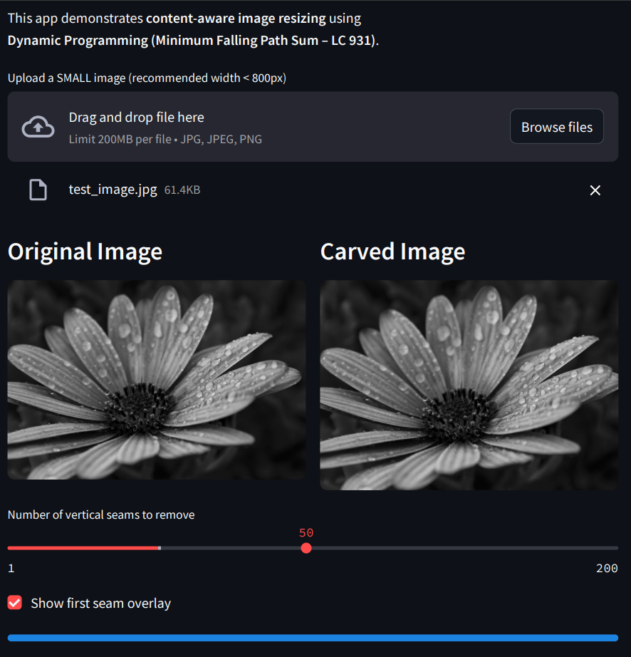
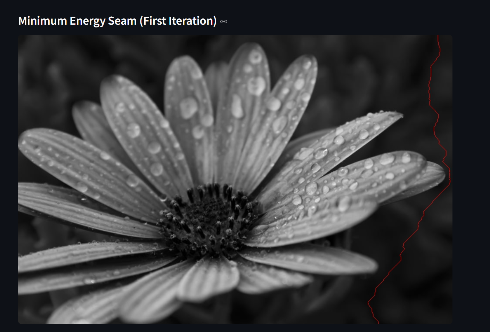

#  Seam Carving using Dynamic Programming (LC 931)

🔗 **Live Demo:** https://seam-carving-tafsdg22btaelfknshxcsn.streamlit.app/
> Note: For smooth performance, please upload small images (recommended width < 800px).

##  Overview

This project implements **seam carving**, a content-aware image resizing algorithm, using **Dynamic Programming**.
The core idea is to repeatedly remove the **least important vertical seam** from an image, where importance is defined using an energy function.

The implementation is inspired by studying the **Minimum Falling Path Sum** problem on LeetCode (LC 931) and mapping that DP formulation to a real-world application.

An interactive **Streamlit app** is provided to visualize the resizing process.

---

##  Key Idea: DP → Seam Carving

A **vertical seam** is defined as:

* One pixel per row
* Connected top to bottom
* Each step can move:

  * straight down
  * down-left
  * down-right

This is **exactly the same structure** as the *Minimum Falling Path Sum* problem.

### DP Mapping

| LeetCode 931 | Seam Carving          |
| ------------ | --------------------- |
| Matrix cell  | Pixel                 |
| Cell value   | Energy of pixel       |
| Falling path | Vertical seam         |
| Min path sum | Least noticeable seam |

---

##  DP Formulation

Let `energy[i][j]` be the energy (importance) of pixel at row `i`, column `j`.

The DP recurrence is:

```
dp[i][j] = energy[i][j] + min(
              dp[i+1][j-1],
              dp[i+1][j],
              dp[i+1][j+1]
          )
```

* DP is computed **bottom-up**
* Only the previous row is stored → **O(W) space**
* A `parent` matrix stores choices to reconstruct the seam path

This formulation is directly adapted from **LC 931**, with added path reconstruction.

---

##  Algorithm Steps

1. Convert image to grayscale
2. Compute energy map using Sobel gradients
3. Use space-optimized DP to find minimum-energy vertical seam
4. Reconstruct seam using parent pointers
5. Remove one pixel per row along the seam
6. Repeat seam removal `k` times

---

##  Streamlit App

The Streamlit app allows users to:

* Upload a small image
* Choose number of vertical seams to remove
* Visualize:

  * Original image
  * First seam overlay
  * Final carved image (side-by-side)

This helps connect **DP theory** with **visual intuition**.

---
##  Output (Streamlit App)

### Original vs Carved Image
The app displays the original image alongside the carved result after
removing multiple low-energy vertical seams using Dynamic Programming.



---

### Minimum Energy Seam Visualization
The first vertical seam (minimum falling path) is highlighted in red,
showing how DP avoids high-energy regions.




---
##  Tech Stack

* Python
* NumPy
* OpenCV
* Streamlit

---

##  Time & Space Complexity

Let:

* `H` = image height
* `W` = image width
* `k` = number of seams removed

**Time Complexity**:

```
O(k · H · W)
```

**Space Complexity (DP)**:

```
O(W)   (excluding parent storage)
```

Due to Python’s loop overhead, the app is intended for **small to medium-sized images**.

---

## 📚 Inspiration & Credits

* **Dynamic Programming Inspiration**
  This project was inspired by solving the *Minimum Falling Path Sum* problem (LC 931) on LeetCode and exploring how classical DP problems map to real-world applications.

* **Reference Article**
  The Streamlit-based visualization idea was inspired by the following GeeksforGeeks article:

  > *Resize an Image using Seam Carving Algorithm and Streamlit*
  > GeeksforGeeks

  The algorithmic implementation here was written independently with a strong focus on DP formulation and space optimization.

---

## 🚀 How to Run

```bash
pip install -r requirements.txt
streamlit run app.py
```

Upload a **small image (recommended width < 800px)** for smooth performance.

---

## 📌 Future Extensions

* Horizontal seam removal
* Color image seam carving
* Alternative energy functions
* Performance optimization using C++ / Numba

---

##  Takeaway

This project demonstrates how a **standard DP problem** can be extended into a **practical, visual application**, reinforcing both algorithmic understanding and system-level thinking.

